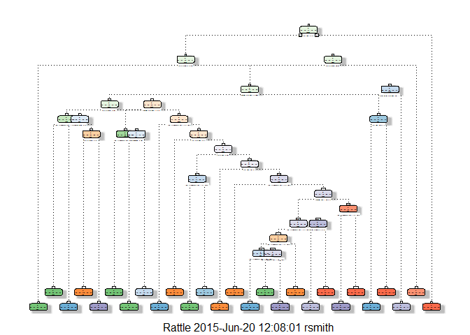

# Practical Machine Learning - Prediction Assignment


# Executive Summary

Using devices such as Jawbone Up, Nike FuelBand, and Fitbit it is now possible to collect a large amount of data about personal activity. The main objective is to use data from accelerometers on the belt, forearm, arm, and dumbell of 6 participants to quantify quantify how well they do  a particular activity

# Exploratory Analysis


```r
library(caret);library(rattle); library(rpart.plot);library(doParallel)
```

```
## Loading required package: lattice
## Loading required package: ggplot2
## Rattle: A free graphical interface for data mining with R.
## Version 3.4.1 Copyright (c) 2006-2014 Togaware Pty Ltd.
## Type 'rattle()' to shake, rattle, and roll your data.
## Loading required package: rpart
## Loading required package: foreach
## Loading required package: iterators
## Loading required package: parallel
```

```r
setwd("C:\\Raphael\\estudos\\datasciencecoursera\\Machine Learning")
# download.file('https://d396qusza40orc.cloudfront.net/predmachlearn/pml-training.csv', 'pml-training.csv')
# download.file('https://d396qusza40orc.cloudfront.net/predmachlearn/pml-testing.csv','pml-testing.csv' )

train_file = read.csv('pml-training.csv', na.strings=c("NA","#DIV/0!", ""))
test_file = read.csv('pml-testing.csv' , na.strings=c("NA", "#DIV/0!", ""))

str(train_file)
```

```
## 'data.frame':	19622 obs. of  160 variables:
##  $ X                       : int  1 2 3 4 5 6 7 8 9 10 ...
##  $ user_name               : Factor w/ 6 levels "adelmo","carlitos",..: 2 2 2 2 2 2 2 2 2 2 ...
##  $ raw_timestamp_part_1    : int  1323084231 1323084231 1323084231 1323084232 1323084232 1323084232 1323084232 1323084232 1323084232 1323084232 ...
##  $ raw_timestamp_part_2    : int  788290 808298 820366 120339 196328 304277 368296 440390 484323 484434 ...
##  $ cvtd_timestamp          : Factor w/ 20 levels "02/12/2011 13:32",..: 9 9 9 9 9 9 9 9 9 9 ...
##  $ new_window              : Factor w/ 2 levels "no","yes": 1 1 1 1 1 1 1 1 1 1 ...
##  $ num_window              : int  11 11 11 12 12 12 12 12 12 12 ...
##  $ roll_belt               : num  1.41 1.41 1.42 1.48 1.48 1.45 1.42 1.42 1.43 1.45 ...
##  $ pitch_belt              : num  8.07 8.07 8.07 8.05 8.07 8.06 8.09 8.13 8.16 8.17 ...
##  $ yaw_belt                : num  -94.4 -94.4 -94.4 -94.4 -94.4 -94.4 -94.4 -94.4 -94.4 -94.4 ...
##  $ total_accel_belt        : int  3 3 3 3 3 3 3 3 3 3 ...
##  $ kurtosis_roll_belt      : num  NA NA NA NA NA NA NA NA NA NA ...
##  $ kurtosis_picth_belt     : num  NA NA NA NA NA NA NA NA NA NA ...
##  $ kurtosis_yaw_belt       : logi  NA NA NA NA NA NA ...
##  $ skewness_roll_belt      : num  NA NA NA NA NA NA NA NA NA NA ...
##  $ skewness_roll_belt.1    : num  NA NA NA NA NA NA NA NA NA NA ...
##  $ skewness_yaw_belt       : logi  NA NA NA NA NA NA ...
##  $ max_roll_belt           : num  NA NA NA NA NA NA NA NA NA NA ...
##  $ max_picth_belt          : int  NA NA NA NA NA NA NA NA NA NA ...
##  $ max_yaw_belt            : num  NA NA NA NA NA NA NA NA NA NA ...
##  $ min_roll_belt           : num  NA NA NA NA NA NA NA NA NA NA ...
##  $ min_pitch_belt          : int  NA NA NA NA NA NA NA NA NA NA ...
##  $ min_yaw_belt            : num  NA NA NA NA NA NA NA NA NA NA ...
##  $ amplitude_roll_belt     : num  NA NA NA NA NA NA NA NA NA NA ...
##  $ amplitude_pitch_belt    : int  NA NA NA NA NA NA NA NA NA NA ...
##  $ amplitude_yaw_belt      : num  NA NA NA NA NA NA NA NA NA NA ...
##  $ var_total_accel_belt    : num  NA NA NA NA NA NA NA NA NA NA ...
##  $ avg_roll_belt           : num  NA NA NA NA NA NA NA NA NA NA ...
##  $ stddev_roll_belt        : num  NA NA NA NA NA NA NA NA NA NA ...
##  $ var_roll_belt           : num  NA NA NA NA NA NA NA NA NA NA ...
##  $ avg_pitch_belt          : num  NA NA NA NA NA NA NA NA NA NA ...
##  $ stddev_pitch_belt       : num  NA NA NA NA NA NA NA NA NA NA ...
##  $ var_pitch_belt          : num  NA NA NA NA NA NA NA NA NA NA ...
##  $ avg_yaw_belt            : num  NA NA NA NA NA NA NA NA NA NA ...
##  $ stddev_yaw_belt         : num  NA NA NA NA NA NA NA NA NA NA ...
##  $ var_yaw_belt            : num  NA NA NA NA NA NA NA NA NA NA ...
##  $ gyros_belt_x            : num  0 0.02 0 0.02 0.02 0.02 0.02 0.02 0.02 0.03 ...
##  $ gyros_belt_y            : num  0 0 0 0 0.02 0 0 0 0 0 ...
##  $ gyros_belt_z            : num  -0.02 -0.02 -0.02 -0.03 -0.02 -0.02 -0.02 -0.02 -0.02 0 ...
##  $ accel_belt_x            : int  -21 -22 -20 -22 -21 -21 -22 -22 -20 -21 ...
##  $ accel_belt_y            : int  4 4 5 3 2 4 3 4 2 4 ...
##  $ accel_belt_z            : int  22 22 23 21 24 21 21 21 24 22 ...
##  $ magnet_belt_x           : int  -3 -7 -2 -6 -6 0 -4 -2 1 -3 ...
##  $ magnet_belt_y           : int  599 608 600 604 600 603 599 603 602 609 ...
##  $ magnet_belt_z           : int  -313 -311 -305 -310 -302 -312 -311 -313 -312 -308 ...
##  $ roll_arm                : num  -128 -128 -128 -128 -128 -128 -128 -128 -128 -128 ...
##  $ pitch_arm               : num  22.5 22.5 22.5 22.1 22.1 22 21.9 21.8 21.7 21.6 ...
##  $ yaw_arm                 : num  -161 -161 -161 -161 -161 -161 -161 -161 -161 -161 ...
##  $ total_accel_arm         : int  34 34 34 34 34 34 34 34 34 34 ...
##  $ var_accel_arm           : num  NA NA NA NA NA NA NA NA NA NA ...
##  $ avg_roll_arm            : num  NA NA NA NA NA NA NA NA NA NA ...
##  $ stddev_roll_arm         : num  NA NA NA NA NA NA NA NA NA NA ...
##  $ var_roll_arm            : num  NA NA NA NA NA NA NA NA NA NA ...
##  $ avg_pitch_arm           : num  NA NA NA NA NA NA NA NA NA NA ...
##  $ stddev_pitch_arm        : num  NA NA NA NA NA NA NA NA NA NA ...
##  $ var_pitch_arm           : num  NA NA NA NA NA NA NA NA NA NA ...
##  $ avg_yaw_arm             : num  NA NA NA NA NA NA NA NA NA NA ...
##  $ stddev_yaw_arm          : num  NA NA NA NA NA NA NA NA NA NA ...
##  $ var_yaw_arm             : num  NA NA NA NA NA NA NA NA NA NA ...
##  $ gyros_arm_x             : num  0 0.02 0.02 0.02 0 0.02 0 0.02 0.02 0.02 ...
##  $ gyros_arm_y             : num  0 -0.02 -0.02 -0.03 -0.03 -0.03 -0.03 -0.02 -0.03 -0.03 ...
##  $ gyros_arm_z             : num  -0.02 -0.02 -0.02 0.02 0 0 0 0 -0.02 -0.02 ...
##  $ accel_arm_x             : int  -288 -290 -289 -289 -289 -289 -289 -289 -288 -288 ...
##  $ accel_arm_y             : int  109 110 110 111 111 111 111 111 109 110 ...
##  $ accel_arm_z             : int  -123 -125 -126 -123 -123 -122 -125 -124 -122 -124 ...
##  $ magnet_arm_x            : int  -368 -369 -368 -372 -374 -369 -373 -372 -369 -376 ...
##  $ magnet_arm_y            : int  337 337 344 344 337 342 336 338 341 334 ...
##  $ magnet_arm_z            : int  516 513 513 512 506 513 509 510 518 516 ...
##  $ kurtosis_roll_arm       : num  NA NA NA NA NA NA NA NA NA NA ...
##  $ kurtosis_picth_arm      : num  NA NA NA NA NA NA NA NA NA NA ...
##  $ kurtosis_yaw_arm        : num  NA NA NA NA NA NA NA NA NA NA ...
##  $ skewness_roll_arm       : num  NA NA NA NA NA NA NA NA NA NA ...
##  $ skewness_pitch_arm      : num  NA NA NA NA NA NA NA NA NA NA ...
##  $ skewness_yaw_arm        : num  NA NA NA NA NA NA NA NA NA NA ...
##  $ max_roll_arm            : num  NA NA NA NA NA NA NA NA NA NA ...
##  $ max_picth_arm           : num  NA NA NA NA NA NA NA NA NA NA ...
##  $ max_yaw_arm             : int  NA NA NA NA NA NA NA NA NA NA ...
##  $ min_roll_arm            : num  NA NA NA NA NA NA NA NA NA NA ...
##  $ min_pitch_arm           : num  NA NA NA NA NA NA NA NA NA NA ...
##  $ min_yaw_arm             : int  NA NA NA NA NA NA NA NA NA NA ...
##  $ amplitude_roll_arm      : num  NA NA NA NA NA NA NA NA NA NA ...
##  $ amplitude_pitch_arm     : num  NA NA NA NA NA NA NA NA NA NA ...
##  $ amplitude_yaw_arm       : int  NA NA NA NA NA NA NA NA NA NA ...
##  $ roll_dumbbell           : num  13.1 13.1 12.9 13.4 13.4 ...
##  $ pitch_dumbbell          : num  -70.5 -70.6 -70.3 -70.4 -70.4 ...
##  $ yaw_dumbbell            : num  -84.9 -84.7 -85.1 -84.9 -84.9 ...
##  $ kurtosis_roll_dumbbell  : num  NA NA NA NA NA NA NA NA NA NA ...
##  $ kurtosis_picth_dumbbell : num  NA NA NA NA NA NA NA NA NA NA ...
##  $ kurtosis_yaw_dumbbell   : logi  NA NA NA NA NA NA ...
##  $ skewness_roll_dumbbell  : num  NA NA NA NA NA NA NA NA NA NA ...
##  $ skewness_pitch_dumbbell : num  NA NA NA NA NA NA NA NA NA NA ...
##  $ skewness_yaw_dumbbell   : logi  NA NA NA NA NA NA ...
##  $ max_roll_dumbbell       : num  NA NA NA NA NA NA NA NA NA NA ...
##  $ max_picth_dumbbell      : num  NA NA NA NA NA NA NA NA NA NA ...
##  $ max_yaw_dumbbell        : num  NA NA NA NA NA NA NA NA NA NA ...
##  $ min_roll_dumbbell       : num  NA NA NA NA NA NA NA NA NA NA ...
##  $ min_pitch_dumbbell      : num  NA NA NA NA NA NA NA NA NA NA ...
##  $ min_yaw_dumbbell        : num  NA NA NA NA NA NA NA NA NA NA ...
##  $ amplitude_roll_dumbbell : num  NA NA NA NA NA NA NA NA NA NA ...
##   [list output truncated]
```

```r
table(train_file$classe)
```

```
## 
##    A    B    C    D    E 
## 5580 3797 3422 3216 3607
```

# Preparing data

In order to clean data, I've decided to exclude all variables with NA's and other with no direct relationship to "classe".


```r
selected = which((colSums(!is.na(train_file)) >= nrow(train_file)))
train_data = train_file[,selected]
test_data = test_file[,selected]

test_data = test_data[-ncol(test_data)]
test_data$new_window = factor(test_data$new_window, levels=c("no","yes"))

train_data = train_data[,-c(1,5)]
test_data = test_data[,-c(1,5)]

names(selected)
```

```
##  [1] "X"                    "user_name"            "raw_timestamp_part_1"
##  [4] "raw_timestamp_part_2" "cvtd_timestamp"       "new_window"          
##  [7] "num_window"           "roll_belt"            "pitch_belt"          
## [10] "yaw_belt"             "total_accel_belt"     "gyros_belt_x"        
## [13] "gyros_belt_y"         "gyros_belt_z"         "accel_belt_x"        
## [16] "accel_belt_y"         "accel_belt_z"         "magnet_belt_x"       
## [19] "magnet_belt_y"        "magnet_belt_z"        "roll_arm"            
## [22] "pitch_arm"            "yaw_arm"              "total_accel_arm"     
## [25] "gyros_arm_x"          "gyros_arm_y"          "gyros_arm_z"         
## [28] "accel_arm_x"          "accel_arm_y"          "accel_arm_z"         
## [31] "magnet_arm_x"         "magnet_arm_y"         "magnet_arm_z"        
## [34] "roll_dumbbell"        "pitch_dumbbell"       "yaw_dumbbell"        
## [37] "total_accel_dumbbell" "gyros_dumbbell_x"     "gyros_dumbbell_y"    
## [40] "gyros_dumbbell_z"     "accel_dumbbell_x"     "accel_dumbbell_y"    
## [43] "accel_dumbbell_z"     "magnet_dumbbell_x"    "magnet_dumbbell_y"   
## [46] "magnet_dumbbell_z"    "roll_forearm"         "pitch_forearm"       
## [49] "yaw_forearm"          "total_accel_forearm"  "gyros_forearm_x"     
## [52] "gyros_forearm_y"      "gyros_forearm_z"      "accel_forearm_x"     
## [55] "accel_forearm_y"      "accel_forearm_z"      "magnet_forearm_x"    
## [58] "magnet_forearm_y"     "magnet_forearm_z"     "classe"
```


# Training data

70% train, 30% test


```r
set.seed(10)
inTrain = createDataPartition(train_data$classe, p = 0.7, list = FALSE)
training = train_data[inTrain, ]
testing = train_data[-inTrain, ]
```

# Random Forest


```r
class = training$classe
data = training[-ncol(training)]

registerDoParallel()
modFit <- train(data, class, method="parRF", tuneGrid=data.frame(mtry=3), trControl=trainControl(method="none"))
```

```
## Loading required package: randomForest
## randomForest 4.6-10
## Type rfNews() to see new features/changes/bug fixes.
```

```r
modFit
```

```
## Parallel Random Forest 
## 
## 13737 samples
##    57 predictor
##     5 classes: 'A', 'B', 'C', 'D', 'E' 
## 
## No pre-processing
## Resampling: None
```

```r
modFit$finalModel
```

```
## 
## Call:
##  randomForest(x = "x", y = "y", ntree = 84, mtry = 3) 
##                Type of random forest: classification
##                      Number of trees: 252
## No. of variables tried at each split: 3
```

```r
test_predict <- predict(modFit, newdata=testing)
confMatrix <- confusionMatrix(test_predict,testing$classe)
confMatrix
```

```
## Confusion Matrix and Statistics
## 
##           Reference
## Prediction    A    B    C    D    E
##          A 1674    3    0    0    0
##          B    0 1136    3    0    0
##          C    0    0 1023    3    0
##          D    0    0    0  960    2
##          E    0    0    0    1 1080
## 
## Overall Statistics
##                                           
##                Accuracy : 0.998           
##                  95% CI : (0.9964, 0.9989)
##     No Information Rate : 0.2845          
##     P-Value [Acc > NIR] : < 2.2e-16       
##                                           
##                   Kappa : 0.9974          
##  Mcnemar's Test P-Value : NA              
## 
## Statistics by Class:
## 
##                      Class: A Class: B Class: C Class: D Class: E
## Sensitivity            1.0000   0.9974   0.9971   0.9959   0.9982
## Specificity            0.9993   0.9994   0.9994   0.9996   0.9998
## Pos Pred Value         0.9982   0.9974   0.9971   0.9979   0.9991
## Neg Pred Value         1.0000   0.9994   0.9994   0.9992   0.9996
## Prevalence             0.2845   0.1935   0.1743   0.1638   0.1839
## Detection Rate         0.2845   0.1930   0.1738   0.1631   0.1835
## Detection Prevalence   0.2850   0.1935   0.1743   0.1635   0.1837
## Balanced Accuracy      0.9996   0.9984   0.9982   0.9977   0.9990
```

```r
confMatrix$overall[1]
```

```
##  Accuracy 
## 0.9979609
```

The model seems to predict quite well, once the Accuracy is about 99.7%.


# Decision Tree


```r
modFit1 <- rpart(classe ~ ., data=training, method="class")
fancyRpartPlot(modFit1)
```

```
## Warning: labs do not fit even at cex 0.15, there may be some overplotting
```

 

```r
test_predict_dt <- predict(modFit1, testing, type = "class")
confusionMatrix(test_predict_dt, testing$classe)
```

```
## Confusion Matrix and Statistics
## 
##           Reference
## Prediction    A    B    C    D    E
##          A 1555    9    3    0   10
##          B   86 1010  102   83   34
##          C    0   30  868   23    6
##          D   27   87   50  814   71
##          E    6    3    3   44  961
## 
## Overall Statistics
##                                          
##                Accuracy : 0.885          
##                  95% CI : (0.8765, 0.893)
##     No Information Rate : 0.2845         
##     P-Value [Acc > NIR] : < 2.2e-16      
##                                          
##                   Kappa : 0.8548         
##  Mcnemar's Test P-Value : < 2.2e-16      
## 
## Statistics by Class:
## 
##                      Class: A Class: B Class: C Class: D Class: E
## Sensitivity            0.9289   0.8867   0.8460   0.8444   0.8882
## Specificity            0.9948   0.9357   0.9879   0.9522   0.9883
## Pos Pred Value         0.9860   0.7681   0.9364   0.7760   0.9449
## Neg Pred Value         0.9724   0.9718   0.9681   0.9690   0.9751
## Prevalence             0.2845   0.1935   0.1743   0.1638   0.1839
## Detection Rate         0.2642   0.1716   0.1475   0.1383   0.1633
## Detection Prevalence   0.2680   0.2234   0.1575   0.1782   0.1728
## Balanced Accuracy      0.9618   0.9112   0.9169   0.8983   0.9383
```

```r
confMatrix$overall[1]
```

```
##  Accuracy 
## 0.9979609
```


# Save files to submit


```r
pml_write_files = function(x){
        n = length(x)
        for(i in 1:n){
                filename = paste0("problem_id_",i,".txt")
                write.table(x[i],file=filename,quote=FALSE,row.names=FALSE,col.names=FALSE)
        }
}

answers <- predict(modFit, test_data)
pml_write_files(answers)
```
